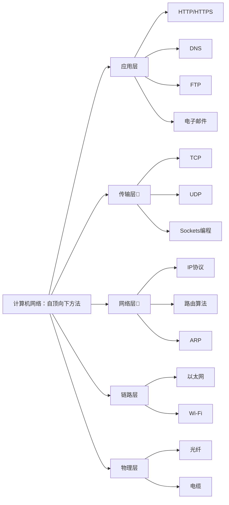

# Computer Network

[TOC]

参考书目：

- 计算机网络 自顶向下 :zap:
- 计算机网络 安德鲁

```mermaid
graph LR
    A[计算机网络：自顶向下方法] --> B[应用层]
    A[计算机网络：自顶向下方法] --> C[传输层👿]
    A[计算机网络：自顶向下方法] --> D[网络层👿]
    A[计算机网络：自顶向下方法] --> E[链路层]
    A[计算机网络：自顶向下方法] --> F[物理层]

    B --> B1[HTTP/HTTPS]
    B --> B2[DNS]
    B --> B3[FTP]
    B --> B4[电子邮件]

    C --> C1[TCP]
    C --> C2[UDP]
    C --> C3[Sockets编程]

    D --> D1[IP协议]
    D --> D2[路由算法]
    D --> D3[ARP]

    E --> E1[以太网]
    E --> E2[Wi-Fi]

    F --> F1[光纤]
    F --> F2[电缆]
```

