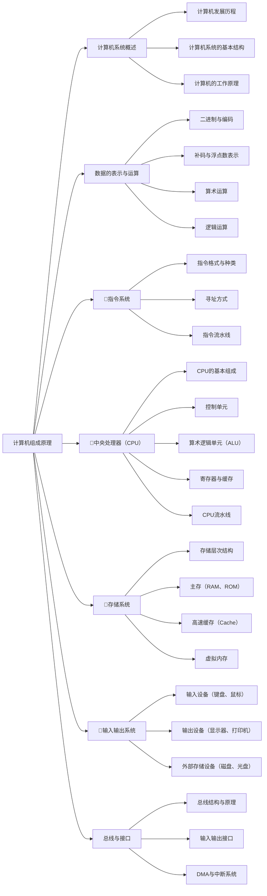

[TOC]

# Computer architecture

参考书籍：

- CSAPP :zap: & 计算机组成原理：软硬件借口(RISC-V)
  - 除了11章，其它章都可以看。

- ICS
  - 唐朔飞版：计算机组成原理--微指令

```mermaid
graph LR
    A[计算机组成原理] --> B[计算机系统概述]
    A[计算机组成原理] --> C[数据的表示与运算]
    A[计算机组成原理] --> D[👿指令系统]
    A[计算机组成原理] --> E[👿中央处理器（CPU）]
    A[计算机组成原理] --> F[👿存储系统]
    A[计算机组成原理] --> G[👿输入输出系统]
    A[计算机组成原理] --> H[总线与接口]

    B --> B1[计算机发展历程]
    B --> B2[计算机系统的基本结构]
    B --> B3[计算机的工作原理]

    C --> C1[二进制与编码]
    C --> C2[补码与浮点数表示]
    C --> C3[算术运算]
    C --> C4[逻辑运算]

    D --> D1[指令格式与种类]
    D --> D2[寻址方式]
    D --> D3[指令流水线]

    E --> E1[CPU的基本组成]
    E --> E2[控制单元]
    E --> E3[算术逻辑单元（ALU）]
    E --> E4[寄存器与缓存]
    E --> E5[CPU流水线]

    F --> F1[存储层次结构]
    F --> F2[主存（RAM、ROM）]
    F --> F3[高速缓存（Cache）]
    F --> F4[虚拟内存]

    G --> G1[输入设备（键盘、鼠标）]
    G --> G2[输出设备（显示器、打印机）]
    G --> G3[外部存储设备（磁盘、光盘）]

    H --> H1[总线结构与原理]
    H --> H2[输入输出接口]
    H --> H3[DMA与中断系统]
```

