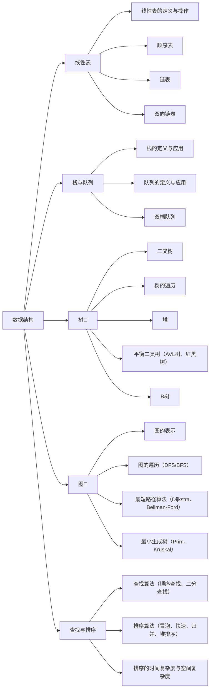

# Data Stuucture

[TOC]

参考书籍

- 算法 第四版
- 算法导论 

```mermaid
graph LR
    A[数据结构] --> B[线性表]
    A[数据结构] --> C[栈与队列]
    A[数据结构] --> D[树👿]
    A[数据结构] --> E[图👿]
    A[数据结构] --> F[查找与排序]

    B --> B1[线性表的定义与操作]
    B --> B2[顺序表]
    B --> B3[链表]
    B --> B4[双向链表]
    
    C --> C1[栈的定义与应用]
    C --> C2[队列的定义与应用]
    C --> C3[双端队列]

    D --> D1[二叉树]
    D --> D2[树的遍历]
    D --> D3[堆]
    D --> D4[平衡二叉树（AVL树、红黑树）]
    D --> D5[B树]

    E --> E1[图的表示]
    E --> E2[图的遍历（DFS/BFS）]
    E --> E3[最短路径算法（Dijkstra、Bellman-Ford）]
    E --> E4[最小生成树（Prim、Kruskal）]

    F --> F1[查找算法（顺序查找、二分查找）]
    F --> F2[排序算法（冒泡、快速、归并、堆排序）]
    F --> F3[排序的时间复杂度与空间复杂度]
```

