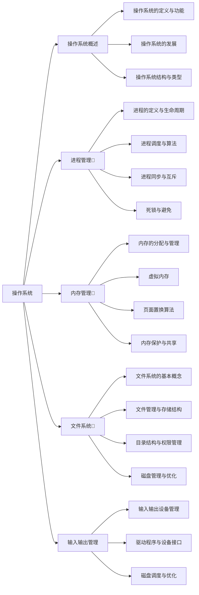
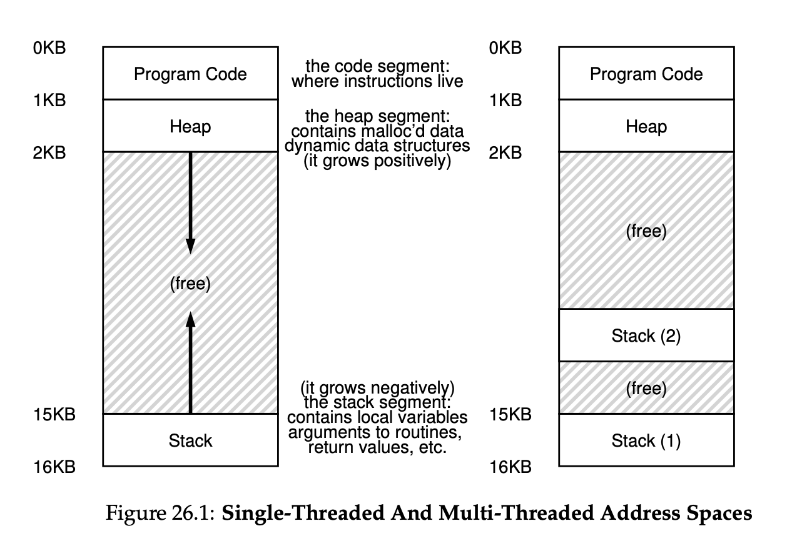
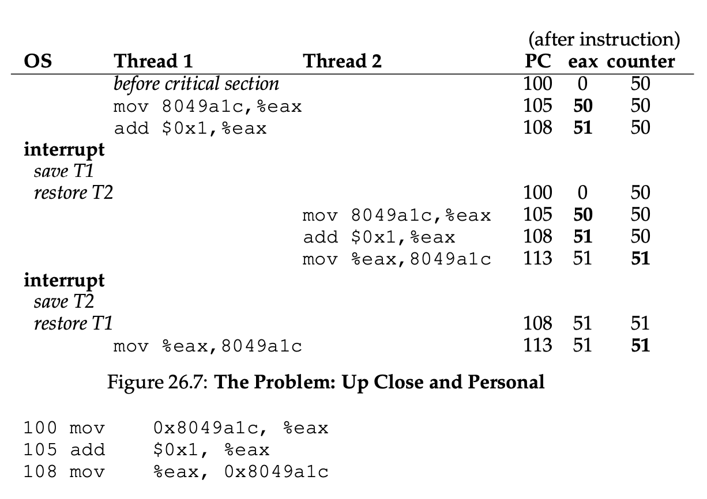
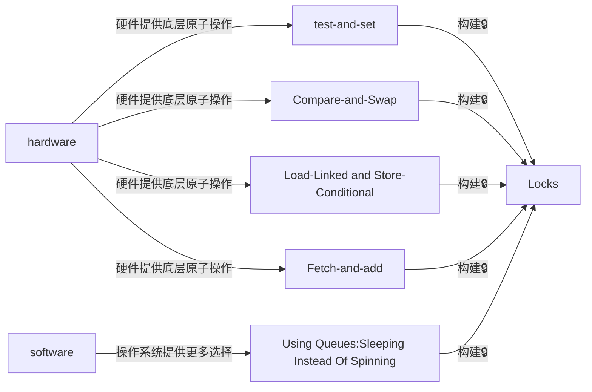
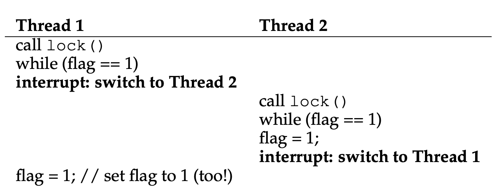

[TOC]

# Operating System

参考书籍

- 现代操作系统
- OSTEP 

表来自于考研大纲，单笔记顺序不同。笔记Part I来自于OSTEP，Part II来自于现代操作系统




## Concurrency(并发)

- 并发的介绍
  - 并发的可能问题
  - 临界区(critical section)、竞争条件(race condition)
  - 原子操作(atmoic operations)、原语(primitive)
- 锁(locks)

### Concurrency Introduction

介绍并发就需要引入`thread(线程)`这个概念

| **特点**       | **进程 (Process)**                                           | **线程 (Thread)**                                            |
| -------------- | ------------------------------------------------------------ | ------------------------------------------------------------ |
| **定义**       | 进程是资源分配的基本单位，包含程序代码、数据、堆栈等。一个进程包含至少一个线程。 | 线程是程序执行的基本单位，是 CPU 调度的最小单位，一个进程可以包含多个线程。 |
| **资源分配**   | 每个进程拥有独立的内存空间、文件描述符、堆栈等资源。         | 线程共享进程的内存空间和其他资源（如打开的文件）。           |
| **开销**       | 进程创建和销毁的开销较大，因为需要为进程分配独立的内存空间和资源。 | 线程创建和销毁的开销较小，因为线程间共享内存和资源。         |
| **通信方式**   | 进程之间的通信（IPC）通常通过**消息传递、管道、共享内存**等机制实现，复杂且开销大。 | 线程之间的通信更加高效，因为它们共享内存，可以直接通过共享数据进行通信。 |
| **内存管理**   | 每个进程有自己的独立内存空间，进程间相互隔离。               | 线程共享进程的内存空间，因此它们之间可以访问相同的变量和数据。 |
| **创建与销毁** | 进程的创建和销毁通常由操作系统负责，且过程较为复杂。         | 线程的创建和销毁由操作系统或线程库负责，通常较为简单。       |
| **独立性**     | 进程是相对独立的，崩溃的进程不会直接影响其他进程。           | 线程是依赖于进程的，某个线程的崩溃可能导致整个进程崩溃。     |
| **调度**       | 进程的调度由操作系统负责，通常较为耗时。                     | 线程的调度由操作系统或线程库负责，调度开销相对较小。         |
| **安全性**     | 进程之间相互独立，一个进程的崩溃通常不会影响到其他进程。     | 线程之间共享内存空间，容易产生数据竞争（race condition）和其他同步问题。 |
| **例子**       | 打开多个应用程序，每个程序（如浏览器、文字处理软件、音乐播放器）都是一个进程。 | 在同一个程序内，有多个线程执行不同的任务（如文本编辑器中处理输入和自动保存的线程）。 |



- race condition (竞争条件)
- critical section:(临界区)
  - is a piece of **code** that accesses a shared variable of more generally,or a shared resource and must not be concurrently executed by more than one thread.

由于系统调度的不确定性，无法保证中断会在何时发生，cpu在中断后会调度那个线程执行。



细看本质是由于这个加法过程被分为了三个机器指令，cpu可以在每条指令的中断周期中断执行该线程并切换到另一个现线程执行，从而导致使用寄存器/内存的值并否事先预料的一样(比如说上述的例子，本来按预想，第二次应该使用`51++`但由于线程1被中断，导致数据还未写会到内存中，从而读出的数据还是`50`)

解决的办法也很简单采用原子操作`Atomic Operations`

**Atomic Operations**  和  **Primitive**

> [!note]
>
> 简单来说，原子操作本身不可切割，而原语是指执行原语的过程不能被中断(表现原子性)。
>
> OSTEP上的英语原文：
>
> What we will instead do is ask the hardware for a few useful instructions upon which we can build a general set of what we call synchronization primitives.

| **特点**     | **原子操作 (Atomic Operation)**                              | **原语 (Primitives)**                                        |
| ------------ | ------------------------------------------------------------ | ------------------------------------------------------------ |
| **定义**     | 原子操作是指在执行时不可被中断的操作，要么完全执行，要么完全不执行。 | 原语是计算机系统中不可再分的基本操作或构造，用于构建更复杂的操作。 |
| **操作粒度** | 原子操作通常是单一的、不可分割的操作（例如增加一个计数器的值）。 | 原语可以是简单的操作，也可以是多个操作的集合，可能用于同步等复杂任务。 |
| **可中断性** | 原子操作保证执行时不会被中断，具有不可分割性。               | 原语本身不一定是原子的，可能包含多个步骤。                   |
| **作用范围** | 原子操作一般用于保证共享数据的更新是安全的（例如通过硬件支持）。 | 原语可以用于实现更复杂的同步和通信机制（如锁、信号量、条件变量等）。 |
| **用途**     | 用于确保并发环境下的数据一致性和防止竞态条件（例如在多线程环境中更新共享资源时）。 | 用于构建并发控制机制，如锁、信号量、条件变量等。             |
| **实现层次** | 原子操作通常由硬件或操作系统提供，能够确保操作的原子性。     | 原语可以由操作系统、库或程序员在更高层次上实现，涉及多个操作。 |
| **例子**     | 增加一个共享变量的值（`atomic_add`），交换两个变量的值（`atomic_swap`）。 | 锁（Lock）、信号量（Semaphore）、条件变量（Condition Variable）。 |
| **并发控制** | 原子操作通过避免中断来控制数据更新的原子性，防止数据竞争。   | 原语通过同步机制协调多个线程或进程的执行，保证共享资源的正确访问。 |
| **开销**     | 原子操作通常具有较小的开销，因为它们在硬件或操作系统级别实现。 | 原语的开销较大，尤其是涉及复杂的同步操作时，可能需要额外的内存和计算资源。 |

**OS 本身就是个并发程序**

### Locks(🔒)



> [!Warning]
>
> 🔒是干嘛的？为啥要引入🔒。
>
> 如果解决并发的方法是组织并发，那为啥还要有并发呢？

评估一把锁的三个方法

- 可行性：如果一把锁连互斥都保证不了，那实现它的意义是啥呢？
- 公平性：是否会导致某个线程永远都获得不了锁呢？
- 性能：锁的实现当然也有不同的性能

回顾一下并发问题的根源来自于cpu调度的不可控性，如果我们粗暴的关闭中断是不是就可以呢？

```c
void lock() {
  											   DisableInterrupts();
}

void unlock() {
    EnableInterrupts();
}
```

> [!note]
>
> 并非所有中断都可以屏蔽，有一类屏蔽(NMI),如断电，即使把中断标志屏蔽了也要被中断处理。

但是开关中断是特权指令，如果任何线程都有能力去开关中断，会导致很⚠️的行为！

那如果仅仅使用Loads/Stores呢？

``` c
typedef struct __lock_t {int flag;} lock_t;

void init(lock_t *mutex) {
   mutex -> flag = 0;
}

void lock(lock_t *mutex) {
  while (mutex -> flag == 1)
      ;
  mutex -> flag = 1;
}

void unlock(lock_t *mutex) {
  mutex -> flag = 0;
}
```

一眼看过去好像可以，但记住`永远设想最坏的调度情况`



此时二者都进不了临界区，全部卡死在`while`循环。

仔细思考会发现，之所以❌的原因是:在检查`mutex->flag`过程被其他线程中断导致读出了旧的值，而否应该更新的新值。

[测试和设置并不是一个原子操作]

> [!note]
>
> **Peterson Alges** 在单处理器的只有两个线程的情况下的互斥算法。
>
> ```c
> int flag[2]; // flag[x] = 1表明该线程想要进入临界区
> int turn; // turn = ? 表明哪个线程允许进入临界区
> 
> void init() {
>   flag[0] = flag[1] = 0;
>   turn = 0;
> }
> 
> void lock() {
>   flag[self] = 1;
>   turn = 1 - self;// 将另一个线程的线程ID✅
>   while ((flag[1-self] == 1) && (turn == 1 - self))
>      ;
> }
> 
> void unlock() {
>   flag[self] = 0;
> }
> ```
>
> 这个算法形象的解释可以看看[jyy的课程](https://www.bilibili.com/video/BV1fi421R7j3/?spm_id_from=333.1007.top_right_bar_window_history.content.click)

第一个硬件支持`test and set`

```c
typedef struct __lock_t {int flag;} lock_t;

void init(lock_t *lock) {
  lock -> flag = 0;
}

void lock(lock_t *lock) {
  while (TestandSet(&lock->flag, 1) == 1) ;
}

void unlock(lock_t *lock) {
  lock -> flag = 0;
}
```

特点`spin lock(自旋锁)` and 需要`preemptive scheduler(抢占式调度)`

- 实现了锁的基本功能
- 不公平
- 性能较差(忙等待⌛️)

类似的硬件支持比如`Compare-And-Swap` & `Load-linked and Store-Conditional` &`Fetch and Add` 都是把不同的操作集合形成了一个原语，值得注意的是`Fetch-and-Add`

```c
int FetchAndAdd(int *ptr) {
  int old = *ptr;
  *ptr = old + 1;
  return old
} // C语言伪代码，由硬件保证其为原子操作(原语)

typedef struct __lock_t {
  int ticket;
  int turn;
} lock_t;

void lock_init (lock_t *lock) {
  lock -> ticket = 0;
  lock -> turn = 0;
}

void lock(lock_t *lock) {
  int myturn = FetchAndAdd(&lock -> ticket);
  while (lock -> turn != myturn) ;
}

void unlock(lock_t *lock) {
  lock -> turn = lock -> turn + 1;
}
```

使用了两个变量，可以保证公平性。无论啥进程只要在自旋总会被分配锁，进入临界区！[保证了公平性]

但是无论是那种硬件提供的保障，首先都会减低效率(忙等待!)其次有些还不能保证公平。这时候就需要操作系统提供帮助了。

思考一种情况，如果一旦检测到锁被人占用就放弃CPU能不能解决这个问题呢？

```c
void init() {
  flag = 0;
}

void lock() {
  while (TestAndSet(&flag, 1) == 1)
    yield(); // give up the cpu
}
```

PS:保证yield()是原语[本质是取消调度自己 deschedules itself]

如果进程数目不多会显著好于单纯的自旋锁，但如果线程很多并且线程调度按顺序调度，则可能需要使用cpu的线程要很久很久很久才回被重新调度会CPU执行，这也有性能损失。

并且这个实现是不公平的。

发现，无论是前者的`忙等待`还是后者`单纯的主动让出cpu`都会导致性能下降，那有没有啥办法可以解决的呢？这时候就需要操作系统提供帮助了。

